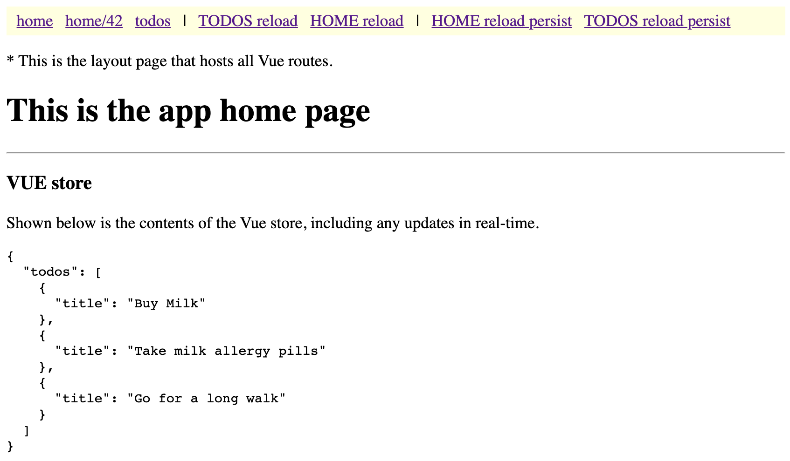

# Vue and Svelte together

This repo shows how to use Vue and Svelte together in the same app to demonstrate the following objectives.

> In all points below we could substitute Vue with any other framework, such as Angular or React (but Svelte stays)

## Objectives
 
1. How to use Svelte web components within an existing app, based on another front-end framework, in this case Vue
    
    1) How to communicate between Vue components and Svelte components (stores, props, events)
    2)
    
2. How to create app pages (routes) that use a completely different framework to the one used for the rest of the app

## Why would you want to mix Vue and Svelte in the same app? 

In most cases there would be no reason to do this, because both Vue and Svelte are great full featured front-end frameworks in their own right. However, if you did want to do this to take advantage of Svelte within your Vue, Angular or React app, then this repo shows you how you might go about it. 

### Why Svelte?

Because Svelte is special, for two reasons. 

#### Svelte is a framework compiler

Svelte is a framework compiler not a framework library. This means that there are no runtime libraries to include or worry about when building for production. No conflicting runtime library versions. 

When Svelte compiles your components for production it generates JavaScript and includes only what you have used from the framework in the built bundles.

> Note: If you use libraries in your Svelte components, you may still encounter some version issues to resolve. 

#### Svelte Web Components

Svelte can build your feature as a web component, also known as a custom element. Custom elements are basically HTML tags, which you can use in most modern frameworks (Angular, React, Vue) or with pure HTML and JS.

## Installation

Clone this repo and change it or pick bits out of it and use in your own app.

Next, open your terminal and `cd` into the folder into which you cloned the repo and run the following command, which will download and install all the necessary npm packages.

```bash
npm i
```

## Usage

To start the app you need to run the npm task "dev". It will start up a dev-server on localhost, port 3000. Click the link in the console, and the app will open up in your browser. You should see something like this.

### The app



This is the home page of the app. At the top is the menu bar, It shows a title and below it the contents of a Vue store, which contains a list of tasks.

### Menu bar sections

The menu bar at the top has three sections, with items that demonstrate the functionality discussed in the objectives section at the top of this document.


## Contributing
Pull requests are welcome. For major changes, please open an issue first to discuss what you would like to change.

Please make sure to update tests as appropriate.

## License
[MIT](https://choosealicense.com/licenses/mit/)
